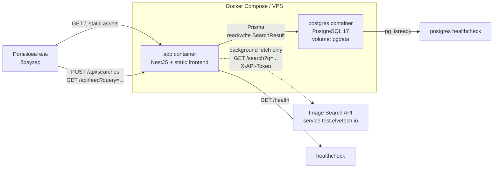
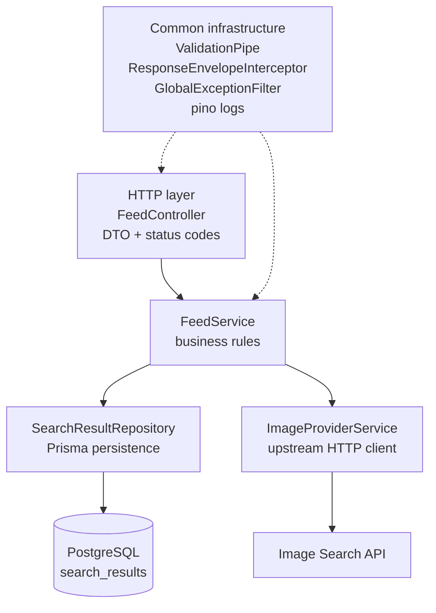
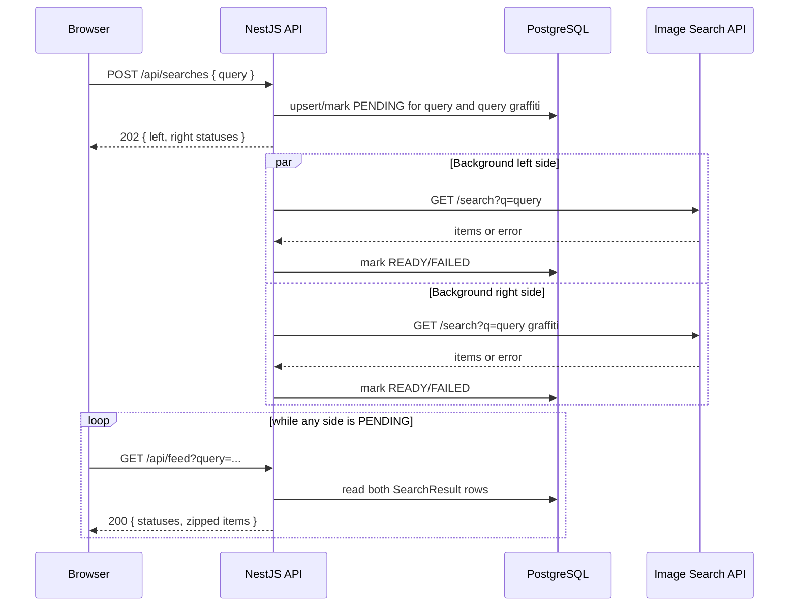

# Архитектурная схема

Схема отражает текущий дизайн из [DESIGN.md](./DESIGN.md): одна NestJS-служба отдаёт API и собранный frontend, PostgreSQL хранит состояние ленты, сторонний Image Search API вызывается только из фоновой загрузки после `POST /api/searches`.

## Runtime view

## Backend layers

## Submit/poll flow

## Ключевые ограничения

- `GET /api/feed` read-only: он никогда не вызывает сторонний сервис.
- Долгий upstream-запрос не держит HTTP-соединение браузера: загрузка идёт в фоне.
- Источник истины для статусов `PENDING` / `READY` / `FAILED` — PostgreSQL.
- Кэширование применяется отдельно к каждому upstream-запросу: `<query>` и `<query> graffiti`.
